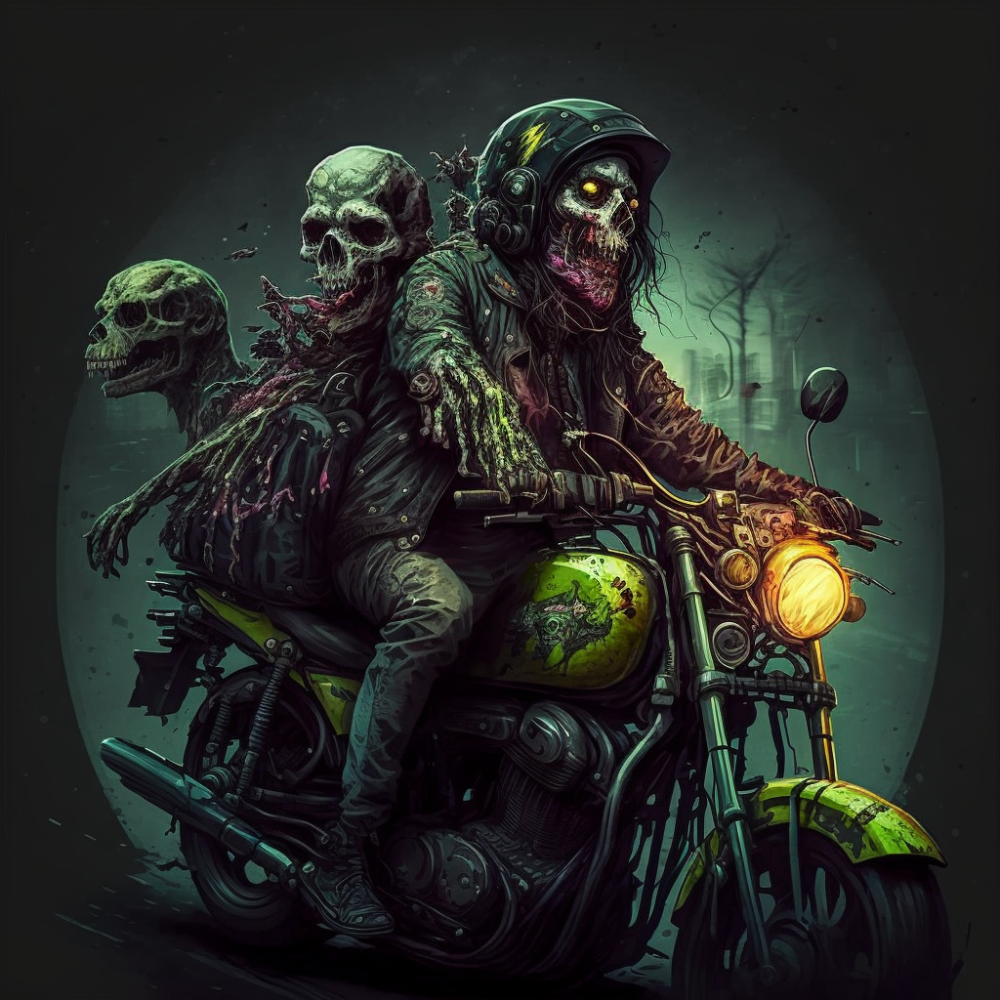

# Cameron Fitzsimmons
 I am a student at [Waimea College](https://waimea.school.nz) in New Zealand studying Level 3 NCEA.

## Interests

When im not coding I like to:

- maps...
- repeat...
- eat
- drink
- watch
- listen
- wait
- feed

## Morning routine

1. wake
2. eat
3. dress
4. bus

## Favorite code

I like scratch, especially `loop until:` blocks

## awsome picture

<!--
**waimea-cfitzsimmons/waimea-cfitzsimmons** is a ✨ _special_ ✨ repository because its `README.md` (this file) appears on your GitHub profile.

Here are some ideas to get you started:

- 🔭 I’m currently working on: DOMINATION
- 🌱 I’m currently learning: COMBAT
- 👯 I’m looking to collaborate on: NOTHING
- 🤔 I’m looking for help with: MURDER
- 💬 Ask me about: WAR
- 📫 How to reach me: PRAY
- 😄 Pronouns: I HATE PRONOUNS
- ⚡ Fun fact: An octupus has 8 hearts
-->
